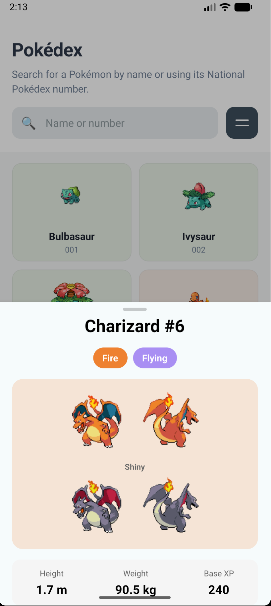
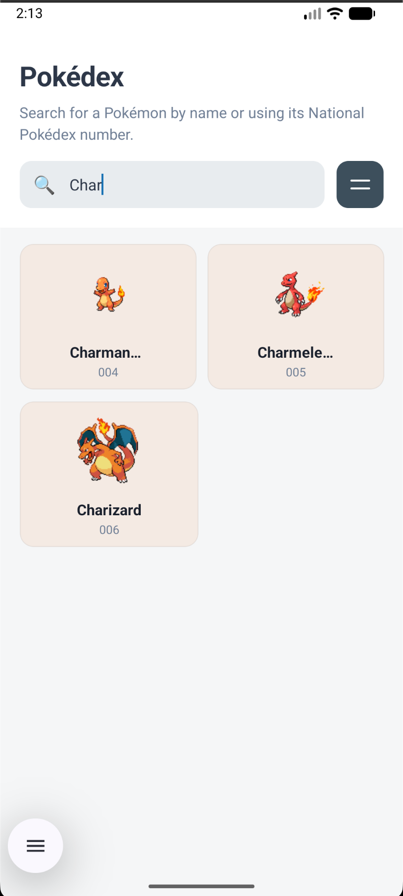

# Pokédex

A mobile Pokédex app built with **Expo** and **React Native**, using the [PokeAPI](https://pokeapi.co/) for Pokemon data. Browse the National Pokédex, search by name or number, and view details in a draggable bottom sheet.

## Screenshots

| Home – Pokédex list | Detail – Bottom sheet | Home – Search |
|--------------------|------------------------|---------------|
|  |  |  |

- **Home list** – Two-column grid of Pokémon with type-colored cards, name, and National Pokédex number.
- **Detail sheet** – Tap a Pokémon to open a draggable bottom sheet with sprites, types, stats, and abilities.
- **Search** – Filter the list by name or National Pokédex number (e.g. `Char` or `006`).

## Features

- **Home screen**
  - Grid of Pokémon cards (sprite, name, number).
  - Search by name or National Pokédex number.
  - Infinite scroll (load more as you scroll).
  - Filter button (UI only; extend as needed).
  - No nav header on home (header hidden for a cleaner look).

- **Detail screen**
  - Opens as a **form sheet** (iOS) with multiple detents (30%, 50%, 70%, 100%).
  - Custom rounded grabber at the top.
  - Shows: name & ID, type badges, default + shiny sprites, height/weight/base XP, base stats (HP, Attack, etc.), and abilities.

- **Tech**
  - [Expo](https://expo.dev/) (SDK 54) + [Expo Router](https://docs.expo.dev/router/introduction/) (file-based routing).
  - TypeScript.
  - Stack navigator with form-sheet presentation for details.

## Prerequisites

- Node.js 18+
- npm or yarn
- [Expo Go](https://expo.dev/go) on your device (or an iOS/Android simulator)

## Setup

1. **Clone and install**

   ```bash
   cd pokemon
   npm install
   ```

2. **Start the dev server**

   ```bash
   npx expo start
   ```

3. **Run the app**

   - **Phone:** Scan the QR code with the Expo Go app (Android) or Camera (iOS).
   - **iOS Simulator:** Press `i` in the terminal.
   - **Android Emulator:** Press `a` in the terminal.

## Project structure

```
pokemon/
├── app/                    # Expo Router screens
│   ├── _layout.tsx         # Root stack (index + details)
│   ├── index.tsx           # Home – Pokédex list, search, pagination
│   └── details/
│       └── [name].tsx      # Pokémon detail (bottom sheet)
├── assets/                 # Icons, splash
├── screenshots/            # App screenshots for README
├── app.json
├── package.json
└── README.md
```

## API

Data comes from [PokeAPI](https://pokeapi.co/):

- List: `GET https://pokeapi.co/api/v2/pokemon?limit=20&offset=...`
- Detail: `GET https://pokeapi.co/api/v2/pokemon/{name}`

No API key required.

## Scripts

| Command | Description |
|---------|-------------|
| `npm start` | Start Expo dev server |
| `npm run ios` | Run on iOS simulator |
| `npm run android` | Run on Android emulator |
| `npm run web` | Run in web browser |

## License

MIT.
